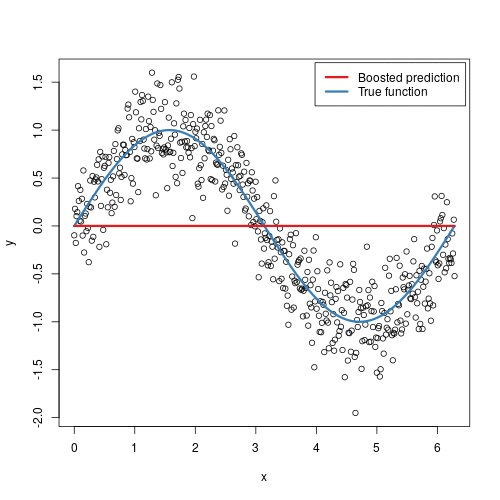

# Short summary of some things in the course

# Entropy

### Shannon Entropy
It is defined as,

Example:
Consider a single toss of skewed coin (it is likely to show one side more than the other side). Regarding the uncertainty of the outcome {head, tail}.

A fair coin that lands 50\% of the time each on heads and tails produces exactly one bit (0 or 1) of entropy per toss. However, if you had a coin that wasn't fair, it produces a fraction of a bit of entropy.
Thus the correct answer is that,

**The entropy is smaller than one bit**

# Decision Trees
To be added.

# k-Nearest Neighbors

The k-NN algorithm assumes that similar things exist in close proximity to each other.

When classifying a point 

1. Select the number of neighbors k
2. For each sample in the data set
   1. Calculate distance between the query point $x$ and the current point
   2. Store distances and the index of the example in an ordered collection
3. Sort the entire ordered collection from smallest to largest distances
4. Pick the first k entries from the sorted collection
5. Get labels of the selected k entries
6. Majority vote classifies the query point 

Pros:

* Simple method, only need to specify k
* Applicable to multi-class problems
* Good performance, effective in low dimension data

Cons:

* Computationally expensive to calculate the distances
* Requires a lot of memory to store 

Comparison k-NN / 1-NN

* Boundary becomes smoother as k increases
* Lower computational cost for lower k
* k-NN generalizes better given many samples 

# Challenges in ML

## The curse of dimensionality

1. If we have more features than observations than we run the risk of massively overfitting our model — this would generally result in terrible out of sample performance.

2. When we have too many features, observations become harder to cluster — believe it or not, **too many dimensions causes every observation in your dataset to appear equidistant from all the others**. And because clustering uses a distance measure such as Euclidean distance to quantify the similarity between observations, this is a big problem. **If the distances are all approximately equal, then all the observations appear equally alike (as well as equally different), and no meaningful clusters can be formed.**

> As the number of features or dimension grows, the amount of data we need to generalize accurately grows exponentially

This exponential growth in data causes high sparsity in the data set and unnecessarily increases storage space and processing time for the particular modelling algorithm.

## The Bias-Variance Tradeoff

Intuitive explanation of bias and variance

The trade off visualized

What in general happens to the prediction error

# Regression

## RANSAC - RANdom SAmpling Consensus

*Repeat M times:*
1. Select a random subset of the original data
2. Fit model to the subset
3. Test all other data against the model. Points which fit the model well according to some loss function are considered to be part of the consensus set
4. The model is reasonably good if sufficiently many points have been classified as part of the consensus set

<!-- ## Nearest Neighbor Regression -->

<!-- # Probabilistic Reasoning
To be added. -->

<!-- # Learning as Inference -->
<!-- To be added. -->

# Priors and Latent Variables
## K-means

K-means is an unsupervised algorithm which is used to identify clusters in data.

1. Choose number of clusters *K*
2. Initialize centroids by first shuffling the data set and then randomly select without replacement *K* data points to use as centroids
3. Compute the distances between the data points and all centroids
4. Assign each data point to the closest centroid
5. Update centroids by taking the average of all data points that belong to each cluster

Repeat steps 3-5

## Expectation maximization
Expectation maximization (EM) is an iterative method used to find *maximum likelihood* (ML) or *maximum a posteriori* (MAP) estimates of parameters in statistical models, where the model depends on unobserved latent variables.

The first mode attempts to estimate the missing or latent variables, called the estimation-step or E-step. The second mode attempts to optimize the parameters of the model to best explain the data, called the maximization-step or M-step.

* E-Step: Create a function for the expectation of the log-likelihood evaluted using the current estimate for the parameters
* M-Step: Compute parameters that maximize the expected log-likelihood found on the E-step. These parameter estimates are then used to determine the distribution of the latent variables in the next E-step.

# Artificial Neural Networks

## Perceptron
A perceptron is a simple mathematical model of a neuron.
A single perceptron can serve as a classifier or regressor. It is a building block in a more complex artifical neural network structures which are used to solve advanced problems.

The perceptron consists of
1. An input layer
2. Weights and Bias used to form a net sum
3. A threshold in the form of an Activation Function. (Maps the input to desired values such as {0,1})
4. An output layer

The network is trained by adjusting the weights and bias each node. Adjustments are made based on the error produced.

A perceptron is a single layer neural network and a multi-layer perceptron is called a Neural Network.

## Backpropagation
Short for backward propagation of errors, is an algorithm for supervised learning of artificial neural networks using gradient descent.

Since we cannot simply train neurons in a network as the desired output is unknown for neurons in the middle layers, we'll use Backpropagation.
Given an error function, the method calculates the gradient of the error function with respect to the neural network's weights. The calculation then proceeds backwards through the network

> Gradient descent is an iterative optimization algorithm for finding the minimum of a function; in our case we want to minimize the error function. To find a local minimum of a function using gradient descent, one takes steps proportional to the negative of the gradient of the function at the current point.

There are three steps in this method:

#### Forward step
*Output values for the nodes*

>We'll use the initial weights and inputs to predict the output. The inputs are multiplied by weights and then passed forward to the next layer.

#### Backward propagating step
*Compute local (generalized) errors*
>The generalized errors are first computed at the output nodes, where the targets are known, and then propagated backwards to assign local errors to every node in the network

#### Local step
*Update weights*
> Once the output values and generalized errors are known for each node in the network, the weights can be updated. This can be done locally since no more global communication is needed.

## Dropout

Large neural nets trained on relatively small datasets can overfit the training data.
Dropout is regularization method for reducing overfitting in neural networks by preventing complex co-adaptations on training data. It is a very efficient way of performing model averaging with neural networks.

> During training, some number of layer outputs are randomly ignored or "dropped out". This has the effect of making the layer look like and be treated like a layer with a different number of nodes and connectivity to the prior layer. In effect, each update to a layer during training is performed with a different "view" of the configured layer.

# Support Vector Machines
To be added

# Ensemble Methods

### Why combine classifiers

> The **crowd** is wiser than any **individual**
The collective knowledge of a diverse and independent body of people typically exceeds the knowledge of any single individual and can be harnessed by voting.

There are four elements to a wise crowd
1. **Diversity of opinion.** People in the crowd should have a range of experiences, education and opinions.
2. **Independence.** Prediction by person in crowd is not influenced by the other people in the crowd.
3. **Decentralization.** People have specializations and local knowledge.
4. **Aggregation.** There is a mechanism for aggregating all predictions into one single prediction, which represents the crowd opinion.

## Boosting

The main idea of boosting is to sequentially add new models to the ensemble. For each particular iteration a new weak learner is trained with respect to the error of the whole ensemble learnt so far.

**Core idea**

* Performance of classifiers  helps define 
* Maintain weights  for each training sample 
* Large weights  imply that  has greater influence on
* **Increase** / *Decrease* weight for point that gets **Wrongly** / *Correctly* classified 
* Calculate reliability coefficient  for classifier  based on the error

Example of the convergence when boosting weak classifiers

## Bagging

Bagging is short for **B**ootstrap **Agg**regati**ng**.

The idea is to form multiple training (bootstrap) samples  from the original training data set by sampling from it with replacement.

Then a model can be trained for each bootstrap sample to generate an ensemble of models. 

Each model can then be combined to form the bagged classifier

Bagging is a procedure to reduce the variance of our classifier. It is a powerful tool to control overfitting of the model. 

**Note:** It only produces good results for **high variance, low bias** classifiers

## Random Forest

A random forest consists of multiple random decision trees. Each tree is built on a random sample of the training data. Then at each node, a subset of features are randomly selected to generate the best split,

> As such, there are two kinds of randomness that form the basic principle of Random Forests,
> 
* Sampling training data (Bagging / Bootstrapping)
* Feature selection at each node

Predictions are made by majority vote from the decision trees in the forest which is why it's an ensemble method.

# Dimensionality Reduction
The general idea is to reduce effective the number of variables, considering only the components with larger variance. There are typically two different approaches to this

1. Feature Selection
   > Try to find a subset of the input data to work with.
2. Feature Extraction / Projection
   > Transform the data from high dimensionality space to a space with lower dimensions.
   

### Feature Selection
Three strategies to work with here: **Filter strategy** (e.g. information gain), **wrapper strategy** (e.g. search guided by accuracy) and **embedded strategy** (regularization methods, e.g. LASSO).

## Principal Component Analysis
Performs a linear mapping of the data to a lower dimensional space in such a way that the variance in the low-dimensional representation is maximized.

This is done by constructing the covariance matrix of the data and then computing the eigendecomposition. The eigenvectors that correspond to the largest eigenvalues (the principal components) are then used to reconstruct a large fraction of the variance of the original data.

## Subspace methods

The concept of subspace: A subspace L is a set of linearly independent vectors that span a space which is a subset of a larger space. The general idea is to exploit the localization of the pattern distribution.

Samples from the same class are similar to each other and should therefore be localized in a subspace spanned by a set of basis vectors .

The projection length is used as a similiarity measurement and is given by,

## Fisher's Method

>The idea is to find the subspace (dimension) that is best suited to classification.

**Fisher's Criterion** is defined as,

Want to maximize the ratio of between-class variance to within-class variance.

Where  is the Lagrange multiplier.

Therefore, 

 The eigenvector corresponding to the largest eigenvalue of  gives A that maximizes Fisher's Criterion
